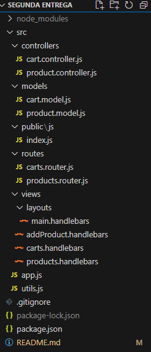

# Segunda pre-entrega

Esta segunda pre-entrega consiste en profesionalizar las consultas de productos con filtros, paginación y ordenamientos como asi tambien de profesionalizar la gestión de carrito para implementar los últimos conceptos vistos.

## Contenidos

1. [Estructura](#estructura)
2. [Instalación](#instalación)
3. [Funcionalidades](#funcionalidades)
4. [Uso](#uso)
5. [API](#api)

## Estructura

La API esta estructurada de la siguiente manera:

    

## Instalación

1. Ejecute el comando `npm install` para instalar las dependencias necesarias.
3. Ejecute el comando `npm start` para iniciar el servidor.

## Funcionalidades

### Productos
Los productos se visualizan en una vista de productos, la misma cuenta con una paginación funcional. Además, pueden filtrarse por categoría, y ordenarse por precio de manera ascendente o descendente.
### Carrito
Se implemento una vista para un carrito en la cual se pueden eliminar todos los productos de este carrito.
Además, se puede agregar o eliminar de a un elemento en dicho carrito.
Se utiliza populate para obetener los productos del carrito.

## Uso
Desde `/products` se puede acceder a la vista general para poder ver todos los productos con el paginado correspondiente, luego tiene un Navbar con el cual se puede navegar e interactuar de forma fácil.

## API
**Router products**
- **GET**: `/products` - Renderiza una vista con todos los productos agregados.
- **GET**: `/product/:pid` - Renderiza una vista con los detalles de un determinado producto.

**Router carts**
- **GET**: `/carts/:cid` - Renderiza una vista con los productos de un determinado carrito.
- **POST**: `/api/carts` - Crea un nuevo carrito.
- **POST**: `/api/carts/:cid/product/:pid` - Agrega un producto a un determinado carrito.
- **PUT**: `api/carts/:cid/products/:pid ` - Actualiza solo la cantidad de ejemplares del producto por cantidad pasada por body.
- **PUT**: `api/carts/:cid` - Actualiza el carrito con un arreglo de productos.
- **DELETE**: `api/carts/:cid/products/:pid` - Elimina del carrito el producto seleccionado.
- **DELETE**: `api/carts/:cid` - Elimina todos los productos del carrito.

